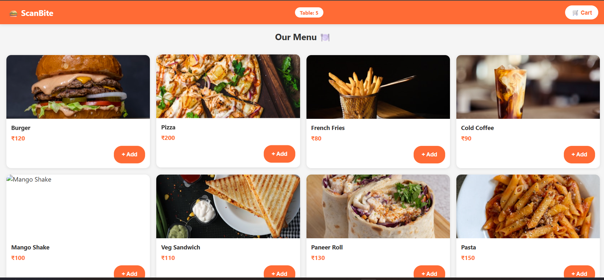
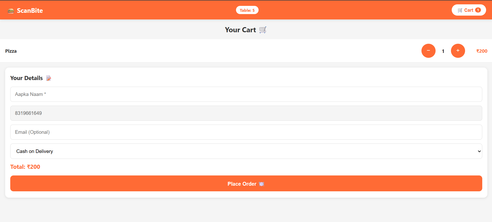
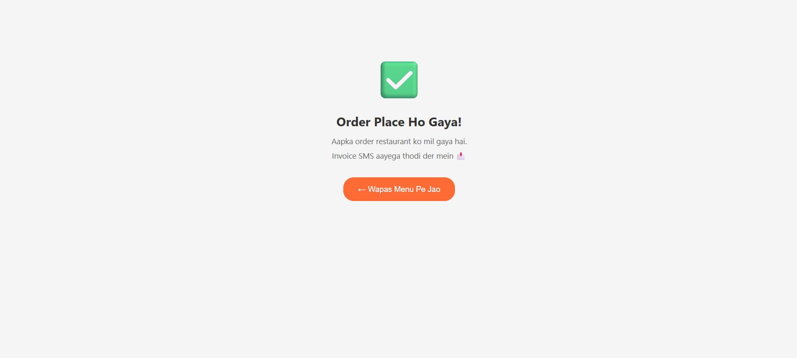
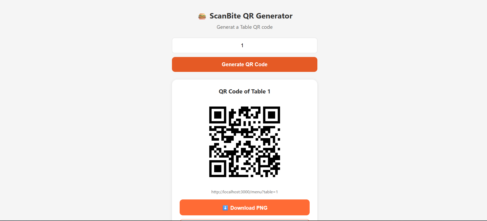
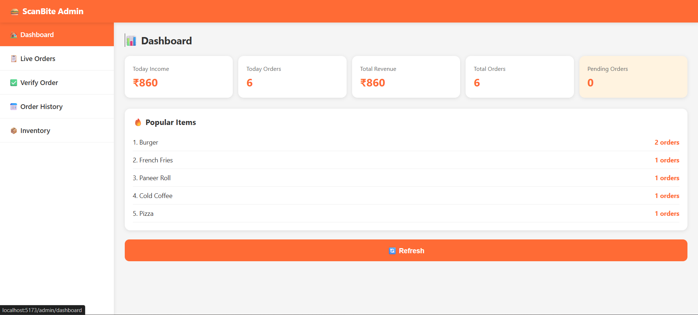
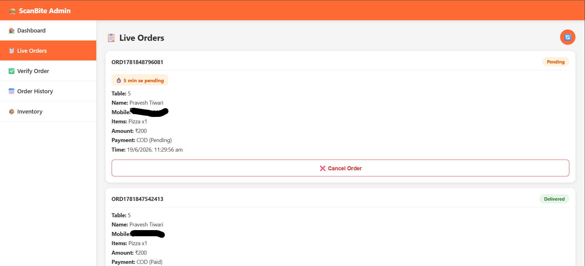
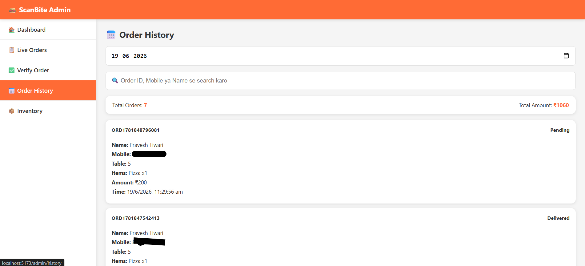
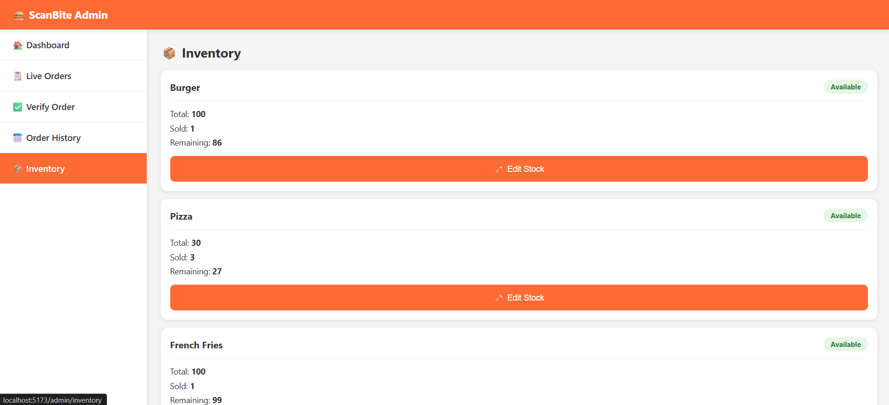
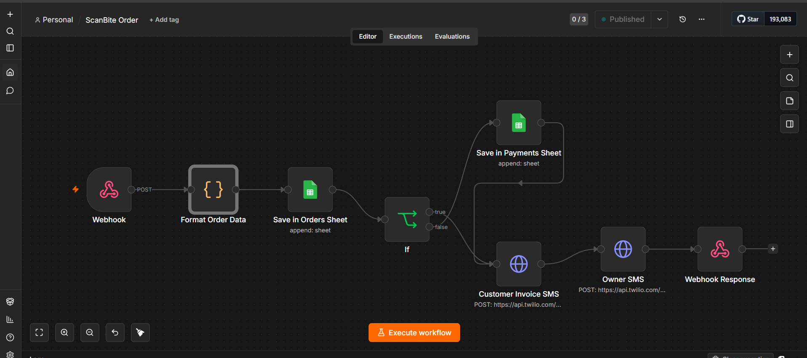

# 🍔 ScanBite — QR Based Restaurant Ordering System

ScanBite is a smart restaurant ordering system that lets customers scan a QR code at their table, browse the menu, place an order, and pay — without waiting for a waiter. Orders are automatically tracked, verified, and managed through a dedicated Admin Panel.

---

## 📌 Problem It Solves

Traditional restaurants face:
- Long waiting times for waiters to take orders
- Manual billing errors
- No real-time visibility into kitchen orders
- No automated invoicing or order tracking

**ScanBite** solves all of this with a QR-based digital ordering flow, automated invoicing via SMS, and a complete admin dashboard for restaurant staff.

---

## 🧩 Tech Stack

| Layer | Technology |
|---|---|
| Frontend | React.js (Vite), React Router, Context API |
| Backend | Node.js, Express.js |
| Database | Google Sheets (via Google Sheets API) |
| Automation | n8n (Docker) |
| Payments | Razorpay |
| SMS / OTP | Twilio (Verify API + Programmable SMS) |
| QR Generation | qrcode.react |
| Deployment (n8n) | Docker / Docker Compose |

---

## 🏗️ System Architecture

```
Customer scans QR Code
        ↓
React Frontend (Menu Page)
        ↓
Mobile OTP Verification (Twilio)
        ↓
Cart → Order Form → Place Order
        ↓
Node.js Backend API
        ↓
   ┌────┴─────┐
   ↓          ↓
Inventory   Razorpay
Check       (if Online)
   ↓          ↓
   └────┬─────┘
        ↓
n8n Webhook (Automation)
        ↓
Google Sheets (Orders / Payments)
        ↓
Twilio SMS → Customer Invoice + Owner Notification
        ↓
Admin Panel → Verify Order (Waiter confirms via code)
        ↓
Order marked "Delivered" + Payment "Paid"
```

---

## ✨ Features

### 👤 Customer Side
- 📱 **QR Code Ordering** — Each table has a unique QR code linking to the menu
- 🍽️ **Live Menu** — Products fetched in real-time from Google Sheets
- 📦 **Stock Awareness** — Out-of-stock items automatically disabled
- 🛒 **Cart System** — Add/remove items, quantity control
- 🔐 **OTP Verification** — Mobile number verified via Twilio before order placement
- 💳 **Flexible Payment** — Cash on Delivery or Razorpay Online Payment
- 🧾 **Automatic Invoice SMS** — Order summary + secret verify code sent via SMS
- ✅ **Order Success Page** — Clean confirmation after placing an order
- 📲 **Mobile Responsive UI** — Optimized for phones, tablets, and desktops

### 🛠️ Admin Panel (`/admin`)
- 🔒 **Password Protected Access** — Only restaurant staff can access
- 🏠 **Dashboard** — Today's revenue, today's orders, total revenue, total orders, pending orders, popular items
- 📋 **Live Orders** — Real-time order feed (auto-refreshes every 15s)
  - ⏱️ **Order Timer** — Shows how long an order has been pending
  - 🔴 **Urgent Highlight** — Orders pending 15+ minutes are visually flagged
  - 🔔 **Sound Alert** — Audio notification when a new order arrives
  - ❌ **Cancel Order** — Cancel mistaken or duplicate orders
- ✅ **Verify Order** — Waiter enters the customer's secret code at the table to confirm delivery and payment
- 📅 **Order History** — Filter orders by date
  - 🔍 **Search** — Search by Order ID, mobile number, or customer name
- 📦 **Inventory Manager** — View and update stock levels per item

### ⚙️ Automation (n8n)
- Webhook-triggered workflow on every new order
- Auto-saves order data into **Orders** sheet
- Auto-saves payment data into **Payments** sheet for online orders
- Sends **Invoice SMS** to customer (with secret verify code)
- Sends **Order Alert SMS** to restaurant owner
- COD vs Online payment branching logic

---

## 🗂️ Database Structure (Google Sheets)

### 1. `Products`
| id | name | price | image | category | available |
|---|---|---|---|---|---|

### 2. `Inventory`
| productID | productName | totalStock | soldQty | remainingStock | status |
|---|---|---|---|---|---|

### 3. `Orders`
| orderID | name | mobile | email | table | items | totalAmount | paymentMethod | paymentStatus | orderStatus | timeStamp | verifyCode | verifiedAt | deliveredAt |
|---|---|---|---|---|---|---|---|---|---|---|---|---|---|

### 4. `Payments`
| orderID | name | mobile | razorpayID | amount | status | timestamp |
|---|---|---|---|---|---|---|

---

## 🔌 API Endpoints

| Method | Endpoint | Description |
|---|---|---|
| `GET` | `/products` | Fetch all menu products |
| `POST` | `/otp/send` | Send OTP to customer mobile |
| `POST` | `/otp/verify` | Verify OTP entered by customer |
| `POST` | `/order` | Place a new order |
| `POST` | `/verify-order` | Verify order via secret code (waiter) |
| `GET` | `/admin/orders` | Get all live orders |
| `GET` | `/admin/orders/history?date=` | Get orders for a specific date |
| `GET` | `/admin/inventory` | Get inventory list |
| `PUT` | `/admin/inventory` | Update inventory stock |
| `GET` | `/admin/dashboard-stats` | Get dashboard statistics |
| `PUT` | `/admin/cancel-order` | Cancel an order |

---

## 🔄 Order Verification Flow

```
1. Customer places an order
2. A random 4-digit verify code is generated
3. Code is sent in the invoice SMS to the customer
4. Waiter picks up the order and goes to the table
5. Customer tells the waiter the code
6. Waiter enters the code in Admin Panel → Verify Order
7. System updates:
      orderStatus  → Delivered
      paymentStatus → Paid
8. Order disappears from the pending list
```

---

## 📂 Project Structure

```
ScanBite/
│
├── frontend/
│   ├── public/
│   │   └── notification.mp3
│   ├── src/
│   │   ├── admin/
│   │   │   ├── AdminLogin.jsx
│   │   │   ├── AdminLayout.jsx
│   │   │   ├── AdminPanel.jsx
│   │   │   ├── Dashboard.jsx
│   │   │   ├── LiveOrders.jsx
│   │   │   ├── VerifyOrder.jsx
│   │   │   ├── OrderHistory.jsx
│   │   │   └── Inventory.jsx
│   │   ├── components/
│   │   │   ├── Menu/
│   │   │   ├── Cart/
│   │   │   ├── Order/
│   │   │   └── shared/
│   │   ├── context/
│   │   │   ├── CartContext.jsx
│   │   │   └── AdminContext.jsx
│   │   ├── hooks/
│   │   ├── pages/
│   │   ├── services/
│   │   │   ├── api.js
│   │   │   └── adminApi.js
│   │   ├── App.jsx
│   │   └── main.jsx
│   └── package.json
│
├── Backend/
│   ├── controllers/
│   │   ├── productController.js
│   │   ├── orderController.js
│   │   ├── otpController.js
│   │   ├── verifyOrderController.js
│   │   └── adminController.js
│   ├── routes/
│   ├── services/
│   │   ├── googleSheetService.js
│   │   ├── n8nService.js
│   │   ├── razorpayService.js
│   │   └── otpService.js
│   ├── config/
│   ├── app.js
│   └── server.js
│
└── scanbite-n8n/
    └── docker-compose.yml
```

---

## ⚙️ Setup & Installation

### 1. Clone the Repository
```bash
git clone https://github.com/your-username/scanbite.git
cd scanbite
```

### 2. Backend Setup
```bash
cd Backend
npm install
```
Create a `.env` file:
```env
PORT=5000
N8N_WEBHOOK_URL=http://localhost:5678/webhook/order
RAZORPAY_KEY_ID=your_razorpay_key_id
RAZORPAY_KEY_SECRET=your_razorpay_key_secret
TWILIO_ACCOUNT_SID=your_twilio_account_sid
TWILIO_AUTH_TOKEN=your_twilio_auth_token
TWILIO_VERIFY_SERVICE_SID=your_twilio_verify_service_sid
```
Run the backend:
```bash
npm run dev
```

### 3. Frontend Setup
```bash
cd frontend
npm install
```
Create a `.env` file:
```env
VITE_API_URL=http://localhost:5000
```
Run the frontend:
```bash
npm run dev
```

### 4. n8n Setup (Docker)
```bash
cd scanbite-n8n
docker-compose up -d
```
Visit `http://localhost:5678`, import the workflow JSON, and configure:
- Google Sheets OAuth2 credentials
- Twilio HTTP Basic Auth credentials

### 5. Generate Table QR Codes
```
Visit: http://localhost:3000/qr-generator
Login with the admin password
Enter a table number → Generate → Download
```

### 6. Access Admin Panel
```
Visit: http://localhost:3000/admin
Login with the admin password
```

---

### Customer Menu Page


### Cart & OTP Verification


### Order Success


### QR Code Generator


### Admin Login


### Admin Dashboard


### Live Orders (with Timer & Cancel)


### Verify Order


### Order History (with Search)


### Inventory Manager


### n8n Workflow


---

## 🚀 Future Scope

- 📊 Export order reports to Excel/CSV
- 🔴 Low stock alerts in Inventory page
- 🖨️ Kitchen Order Ticket (KOT) printing
- 📈 Daily closing report (cash vs online breakdown)
- 📱 PWA support for Admin Panel
- 🏬 Multi-restaurant / multi-branch support
- 🎁 Customer loyalty points system

---

## 👨‍💻 Developer

**Pravesh**
Full Stack Web Application — 2026

---

## 📄 License

This project is open source and available for learning purposes.
